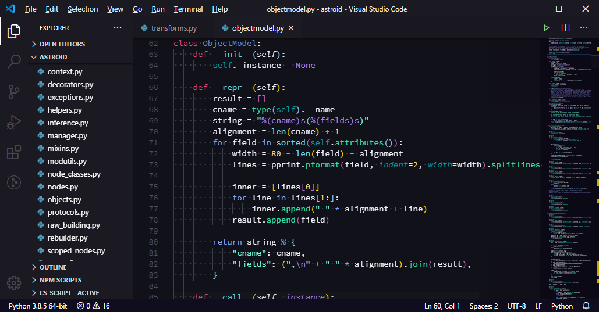

[New York Theme](https://github.com/Bernardi23/New-York-Theme) by Bernardi23 converted to an extension

I have fixed a few problems with transparent colors.

Many colors are still missing.

Conversion done as exercise of making a theme for StackOverflow question [VScode theme install walkthrough](https://stackoverflow.com/questions/65229328/vscode-theme-install-walkthrough)

## Demo

This screenshot uses the extension [Bracket Pair Colorizer](https://marketplace.visualstudio.com/items?itemName=CoenraadS.bracket-pair-colorizer)